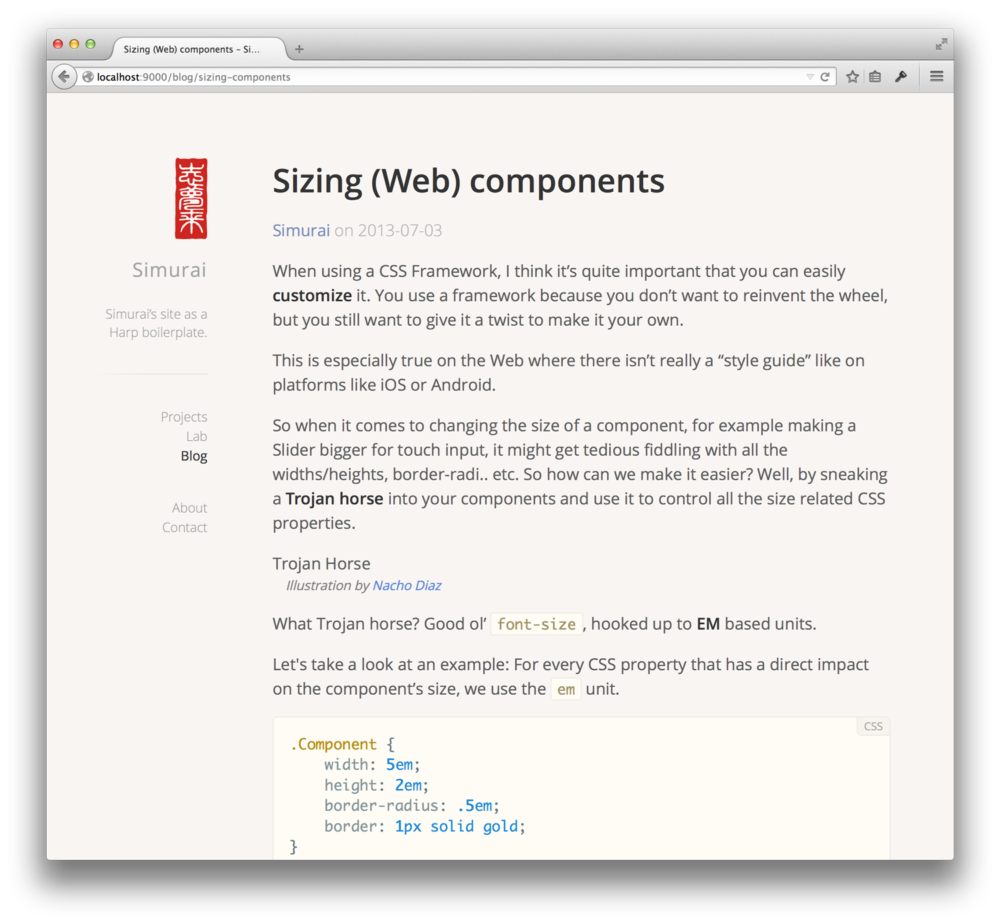

hb-simurai
==========

A Harp boilerplate of [simurai’s site](http://simurai.com/).

[](https://www.harp.io/apps/new?boilerplate=kennethormandy/hb-simurai)

## Get started

Get this site online right away through [the Harp Platform](https://www.harp.io/apps/new?boilerplate=kennethormandy/hb-simurai).

Or, run it locally with [Harp, the static site generator and server](http://harpjs.com/docs/quick-start). First, install [Node.js](http://nodejs.org) installed, and then Harp.

```bash
npm install -g harp
```

You may need to preface this command with `sudo`.

Now, use this boilerplate to create a new Harp app:

```bash
harp init --boilerplate kennethormandy/hb-simurai
harp server
# Visit http://localhost:9000
```

## Simurai supports…

- Markdown posts
- Multiple author support
- Syntax highlighting
- Portfolio section
- Comments through Disqus
- Static draft posts
- Next and previous post links

[…and is totally static, thanks to Harp.](http://harpjs.com)

## Coming soon…

- Configurable font selection via Google Fonts or Typekit
- Nice pullquotes and blockquotes through Markdown

## License

[The MIT License (MIT)](LICENSE)

Copyright © 2014 [simurai](http://simurai.com/) & [Chloi Inc.](http://chloi.io)
